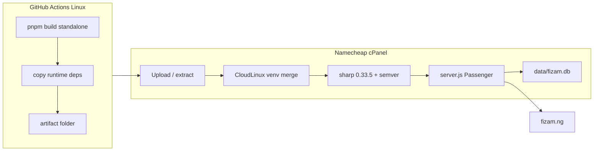

# 08 · Namecheap deployment runbook (cPanel + Node.js)

End-to-end guide for deploying **Fizam** (Next.js 15 + Payload 3 + SQLite) to Namecheap shared hosting. Based on a working production setup at `https://fizam.ng` (May 2026).

**Recommended path:** build on **GitHub Actions** (Linux) → download artifact → upload to cPanel → run **post-extract setup** → restart Node.

---

## Table of contents

1. [How it works](#1-how-it-works)
2. [Prerequisites](#2-prerequisites)
3. [Build the bundle (CI)](#3-build-the-bundle-ci)
4. [cPanel Node.js app setup](#4-cpanel-nodejs-app-setup)
5. [First-time deploy](#5-first-time-deploy)
6. [Post-extract server setup (required)](#6-post-extract-server-setup-required)
7. [Database](#7-database)
8. [Redeploy / updates](#8-redeploy--updates)
9. [Smoke tests](#9-smoke-tests)
10. [Troubleshooting](#10-troubleshooting)
11. [What is *not* on the server](#11-what-is-not-on-the-server)
12. [Reference: files in the repo](#12-reference-files-in-the-repo)

---

## 1. How it works



| Layer | Detail |
|--------|--------|
| **Process** | One Node.js app (`server.js`) serves Next.js + Payload. |
| **Build** | `BUILD_STANDALONE=1` → flat bundle under `.next/standalone/` (shipped as artifact root). |
| **Hosting quirk** | CloudLinux stores npm packages in `~/nodevenv/.../lib/node_modules` and expects `~/fizam.ng/node_modules` to be a **symlink** to that path. |
| **CPU quirk** | Namecheap shared CPUs are often **x86-64-v1**. Use **sharp@0.33.5** (not 0.34.x native, not WebAssembly). |
| **Memory quirk** | CloudLinux `ulimit -v` (~2GB). Node 24 WASM trap handler reserves ~10GB virtual mem → set **`NODE_OPTIONS=--disable-wasm-trap-handler`** in cPanel. |
| **Artifacts quirk** | GitHub drops dot-folders. The bundle ships **`.next` as `next-dist/`** — rename on the server. |
| **Database** | SQLite at `./data/fizam.db`. **Keep this file** across redeploys. |

---

## 2. Prerequisites

| Item | Value |
|------|--------|
| Node (cPanel + CI) | **24.x** (e.g. **24.15.0**) — see `.nvmrc` |
| Package manager (repo) | **pnpm** only — do not run `npm install` in the repo root on your PC |
| GitHub repo | e.g. `tedris94/fizam-table-water` |
| cPanel | **Setup Node.js App** enabled for the domain |
| SSL | AutoSSL / HTTPS for `https://fizam.ng` |

Ignore cPanel’s “recommended” Node 14 — that is legacy. Use the latest **Node 24** offered.

---

## 3. Build the bundle (CI)

### Option A — Automatic FTP deploy (push to `main`)

Workflow: **`.github/workflows/fizamdeploy.yml`** (`Deploy fizam.ng (FTP)`)

On every push to **`main`**, GitHub builds the standalone bundle and uploads it via FTP.

**Repository secrets** (Settings → Secrets and variables → Actions):

| Secret | Example | Notes |
|--------|---------|--------|
| `FTP_HOST` | `ftp.fizam.ng` or server hostname | From cPanel FTP accounts |
| `FTP_USERNAME` | cPanel FTP user | |
| `FTP_PASSWORD` | FTP password | |
| `FTP_PORT` | `21` | Usually `21` (FTPS may use `990`) |
| `FTP_SERVER_DIR` | `fizam.ng/` | Optional. Remote folder under FTP home (trailing slash). Default: `fizam.ng/` |
| `CI_BUILD_PAYLOAD_SECRET` | random hex | Optional. Build-time only |

The workflow **excludes `data/**`** so your live **`fizam.db` is not overwritten**, and **`node_modules/**`** (deps stay in the CloudLinux venv symlink). After you add new npm packages, run **`npm install`** in the venv once (see §5) or do a full **Namecheap standalone ZIP** deploy.

**After each FTP deploy** (still required on Namecheap):

```bash
cd ~/fizam.ng && bash scripts/namecheap-server-setup.sh
```

Then **cPanel → Restart** the Node app.

### Option B — Manual artifact download

1. Push to `main` (or your deploy branch).
2. GitHub → **Actions** → **Namecheap standalone ZIP** → **Run workflow**.
3. Input **`NEXT_PUBLIC_SITE_URL`**: `https://fizam.ng` (no trailing slash).
4. When green (~2 min), open the run → **Artifacts** → download **`fizam-namecheap-standalone`**.
5. Unzip once on your PC. You should see `server.js`, `package.json`, `next-dist/`, `public/`, `node_modules/`, `migrations/`, `DEPLOY_NAMECHEAP.txt`, etc.

**Optional repo secret:** `CI_BUILD_PAYLOAD_SECRET` — used only during `next build`. Production **must** use its own `PAYLOAD_SECRET` in cPanel.

**Do not** rely on a `zip` step inside CI for the full `node_modules` tree — it can timeout. GitHub compresses the uploaded folder when you download the artifact.

### Rebuild when

- Any change to **`NEXT_PUBLIC_*`** (inlined at build time).
- Code / Payload schema changes (new collections, globals, fields).
- After updating `src/migrations/` (run `pnpm payload migrate:create` locally when schema changes).

### Local build (Linux / WSL only)

```bash
cd /path/to/fizam.ng
corepack enable && corepack prepare pnpm@9.15.4 --activate
export BUILD_STANDALONE=1
export NEXT_PUBLIC_SITE_URL=https://fizam.ng
export PAYLOAD_SECRET=$(openssl rand -hex 48)
bash scripts/package-namecheap-standalone.sh
# Upload contents of .next/standalone/ like the CI artifact
```

Windows standalone builds often fail (symlinks). Use CI or WSL.

---

## 4. cPanel Node.js app setup

**Setup Node.js App** → create or edit:

| Field | Value |
|--------|--------|
| Node.js version | **24.15.0** (or latest 24.x) |
| Application mode | **Production** |
| Application root | `fizam.ng` → `/home/USER/fizam.ng` |
| Application URL | `fizam.ng` (path empty = site root) |
| Application startup file | **`server.js`** (do **not** use `launcher.js` under `lsnode` — it spawns a child; LiteSpeed times out waiting for the parent to listen) |
| `NODE_OPTIONS` (cPanel env, required) | `--disable-wasm-trap-handler --require /home/USER/fizam.ng/preload-sharp.cjs` |
| `HOSTNAME` (cPanel env, required) | `0.0.0.0` |
| `NODE_OPTIONS` (cPanel env, optional) | `--disable-wasm-trap-handler --require /home/USER/fizam.ng/preload-sharp.cjs` |

Do **not** use `app.js` for the CI flat bundle.

### Environment variables (minimum)

| Variable | Example | Notes |
|----------|---------|--------|
| `PAYLOAD_SECRET` | long random hex | Required. Never commit. Rotate if leaked. |
| `NEXT_PUBLIC_SITE_URL` | `https://fizam.ng` | No trailing slash. Must match live URL. |
| `DATABASE_URI` | `file:./data/fizam.db` | Optional if default path is fine. |
| `PAYSTACK_SECRET_KEY` | `sk_live_...` | For checkout |
| `NEXT_PUBLIC_PAYSTACK_PUBLIC_KEY` | `pk_live_...` | Client-side |
| `SMTP_HOST`, `SMTP_USER`, `SMTP_PASS`, … | see `.env.example` | Email |
| `CONTACT_NOTIFY_EMAIL`, `HR_NOTIFY_EMAIL` | | Optional |

**Save** → **Restart** after every env change.

---

## 5. First-time deploy

### 5.1 Upload files

1. File Manager → `/home/USER/fizam.ng/`
2. Upload the artifact ZIP (or files).
3. Extract so **`server.js`** is directly in `fizam.ng/`, not in a subfolder.

### 5.2 Clean old artifacts (if redeploying)

```bash
cd ~/fizam.ng
rm -rf node_modules .next next-dist src
# Do NOT delete data/ unless you intend to reset the database
```

### 5.3 Rename Next build output

```bash
cd ~/fizam.ng
mv next-dist .next
test -f .next/BUILD_ID && echo "BUILD_ID OK"
```

### 5.4 Post-extract setup + database

See [§6](#6-post-extract-server-setup-required) and [§7](#7-database).

### 5.5 Restart and verify

cPanel → **Restart** → [§9 Smoke tests](#9-smoke-tests).

---

## 6. Post-extract server setup (required)

CloudLinux **blocks** `npm install` in the app root when `node_modules` is a real folder. The CI ZIP includes `node_modules`, but you must **merge** it into the virtualenv and **reinstall sharp + semver** there.

### Option A — setup script (recommended)

Copy `scripts/namecheap-server-setup.sh` from the repo to the server (or include it in your upload), then:

```bash
cd ~/fizam.ng
chmod +x scripts/namecheap-server-setup.sh
bash scripts/namecheap-server-setup.sh
```

### Option B — post-deploy helper script

After every deployment, run the consolidated helper script:

```bash
cd ~/fizam.ng
chmod +x scripts/namecheap-postdeploy.sh
bash scripts/namecheap-postdeploy.sh
```

This script:

- renames `next-dist` to `.next` if needed
- restores missing `start.cjs` and `preload-sharp.cjs`
- creates/updates `.htaccess` as required
- merges runtime deps into CloudLinux venv
- installs `semver` and `sharp@0.33.5`

### Option B — manual commands

```bash
source ~/nodevenv/fizam.ng/24/bin/activate
cd ~/fizam.ng

VENV_LIB="$HOME/nodevenv/fizam.ng/24/lib"
VENV_NM="${VENV_LIB}/node_modules"
NPM="${VENV_LIB}/../bin/npm"

[[ -d next-dist && ! -d .next ]] && mv next-dist .next

mkdir -p "$VENV_NM" data && chmod 775 data

if [[ -d node_modules ]] && [[ ! -L node_modules ]]; then
  cp -a node_modules/. "$VENV_NM/"
  rm -rf node_modules
fi
ln -sfn "$VENV_NM" node_modules

# Never use sharp-wasm32 on Namecheap (OOM). Never use sharp 0.34+ native (CPU v2 error).
rm -rf "$VENV_NM/@img/sharp-wasm32"
"$NPM" install semver@7 sharp@0.33.5 --include=optional --omit=dev --prefix "$VENV_LIB"

node -e "require('semver/functions/coerce'); require('sharp'); console.log('sharp', require('sharp').versions.sharp)"
```

Then **cPanel → Restart**.

### Why sharp@0.33.5?

| Approach | Result on Namecheap |
|----------|---------------------|
| sharp **0.34.x** linux-x64 | `Unsupported CPU: v2 microarchitecture` |
| **@img/sharp-wasm32** | `WebAssembly.instantiate(): Out of memory` |
| **sharp@0.33.5** linux-x64 | **Works** (verified) |

---

## 7. Database

SQLite file: **`/home/USER/fizam.ng/data/fizam.db`**

### Strategy A — Upload dev database (simplest, proven)

1. On your PC after `pnpm dev` / `pnpm seed`: `data/fizam.db` should be **hundreds of KB**, not 4 KB.
2. cPanel File Manager → upload to `fizam.ng/data/fizam.db`.
3. `chmod 664` on the file, `775` on `data/`.

```bash
sqlite3 data/fizam.db "SELECT name FROM sqlite_master WHERE type='table' AND name='home_page';"
# Should print: home_page
```

Use the **same admin login** as local WAMP.

### Strategy B — Migrations (new deploys after May 2026)

The repo includes `src/migrations/` and `prodMigrations` in `payload.config.ts`. On **Production** start, Payload runs pending migrations when the app boots.

1. Deploy a build that includes this config (new CI artifact).
2. Ensure `data/fizam.db` is missing or empty **only if** you want a fresh DB.
3. **Restart** Node → tables are created.
4. Create first admin at `/admin`.

When you change Payload schema locally:

```bash
pnpm payload migrate:create describe_your_change
git add src/migrations/
git commit && push
# New CI build → redeploy → restart (migrations run automatically)
```

### Strategy C — Development mode (one-time fallback)

Only if migrations are not in your deployed build yet:

1. cPanel → Application mode **Development** → **Restart**
2. Open `https://fizam.ng/admin` once
3. Back to **Production** → **Restart**

### Do not use on production server

- `pnpm run seed` / `scripts/seed.ts` — **not shipped** in the standalone artifact; `tsx` is not installed in the venv.
- `npm install --prefix .` in app root — CloudLinux refuses it.

---

## 8. Redeploy / updates

```bash
cd ~/fizam.ng

# 1. Backup database
cp -a data/fizam.db "data/fizam.db.bak-$(date +%Y%m%d)"

# 2. Remove old app files (not data/)
rm -rf node_modules .next next-dist src

# 3. Upload & extract new artifact ZIP

# 4. Post-extract setup
bash scripts/namecheap-server-setup.sh
# or manual steps from §6

# 5. cPanel → Restart
```

If you added Payload migrations in this release, restart once — they run on boot in Production.

Rebuild CI when you change **`NEXT_PUBLIC_*`** or schema (migrations).

---

## 9. Smoke tests

```bash
cd ~/fizam.ng
: > stderr.log
curl -sI "https://fizam.ng/" | head -5
curl -sI "https://fizam.ng/admin" | head -5
tail -20 stderr.log
```

Expect **`HTTP/2 200`** on `/` and `/admin`. Empty `stderr.log` after requests is ideal.

Browser:

| URL | Expect |
|-----|--------|
| `https://fizam.ng` | Homepage |
| `https://fizam.ng/admin` | Payload login |
| `https://fizam.ng/order` | Checkout (Paystack configured) |

**Note:** `curl http://127.0.0.1:3000` often fails — the app binds to the host name, not localhost. Use `https://fizam.ng` or `http://premiumXXX.web-hosting.com:3000`.

---

## 10. Troubleshooting

| Symptom | Cause | Fix |
|---------|--------|-----|
| **503** | Node app not running | `tail -50 stderr.log`; cPanel **Restart**; test `node server.js` in SSH with env vars |
| **500** + `MODULE_NOT_FOUND` semver | Incomplete `node_modules` | §6 — install `semver@7` in **venv** |
| **500** + sharp CPU v2 | sharp 0.34+ on old CPU | §6 — `sharp@0.33.5` in venv; remove wasm |
| **500** + Wasm OOM | `sharp-wasm32` | `rm -rf .../node_modules/@img/sharp-wasm32`; use 0.33.5 |
| **500** + `no such table: …` | Empty or stale DB | Upload dev `fizam.db` or run migrations (§7) |
| `npm install` refused in app root | CloudLinux symlink rule | §6 — merge into venv, never `npm install --prefix .` |
| `EBADPLATFORM` wasm32 | npm blocks wasm on x64 | Do not install wasm; use sharp 0.33.5 |
| Site works, images broken in admin | sharp / media paths | Check `data/`, `public/media`, Payload uploads |
| Paystack wrong URL | Stale build | Rebuild CI with correct `NEXT_PUBLIC_SITE_URL` |
| 502 after env change | App not restarted | **Save** + **Restart** in cPanel |
| `.next` / BUILD_ID missing | Forgot rename | `mv next-dist .next` |
| **Index of /** (folder listing) | Node app not proxying domain | §4 — startup **`server.js`**, **Restart** |
| `node: command not found` in SSH | `node` not on login PATH | `source ~/nodevenv/fizam.ng/24/bin/activate` or re-run `namecheap-server-setup.sh` |
| cPanel **FileNotFoundError** on Restart | Broken venv / wrong startup / stale `.htaccess` | **Run NPM Install** in cPanel; startup **`server.js`**; remove bad `.htaccess` (see below) |
| **503** + `WebAssembly.instantiate(): Out of memory` | Node 24 WASM cage +/or `sharp-wasm32` | cPanel **`NODE_OPTIONS=--disable-wasm-trap-handler --require …/preload-sharp.cjs`**; purge wasm32; `sharp@0.33.5` + libvips **1.0.4** |
| **500** + `libvips-cpp.so.42: cannot open shared object` | Wrong/missing `@img/sharp-libvips-linux-x64` | Install **`@img/sharp-libvips-linux-x64@1.0.4`** (not `0.33.5`) with `sharp@0.33.5` |
| Sharp OK in SSH, **503/500** on `https://` only | LiteSpeed ignores `PassengerEnvVar` | Use **`launcher.js`** startup + `SetEnv LD_LIBRARY_PATH` in `.htaccess` + libvips symlinks (see §6 / `namecheap-server-setup.sh`) |
| **Request Timeout** on `https://fizam.ng` | `launcher.js` spawns child; **`lsnode` waits on parent** | Startup **`server.js`** + `HOSTNAME=0.0.0.0` + `NODE_OPTIONS` (not `launcher.js`) |

### Useful SSH commands

```bash
# App root
cd ~/fizam.ng

# Logs
tail -40 stderr.log

# DB tables
sqlite3 data/fizam.db ".tables"

# node_modules is symlink?
ls -la node_modules

# Manual start (debug) — always activate venv first (plain `node` is not on SSH PATH)
source ~/nodevenv/fizam.ng/24/bin/activate
export PAYLOAD_SECRET='...'
export DATABASE_URI='file:./data/fizam.db'
export NEXT_PUBLIC_SITE_URL='https://fizam.ng'
node server.js

# Stale .htaccess breaks Passenger (wrong node path / app.js)
ls -la .htaccess 2>/dev/null && head -10 .htaccess
# If it references CPANEL_USER, .nvm, or app.js — rename it:
# mv .htaccess .htaccess.bak
# Then cPanel → Node app → Restart (cPanel regenerates config)

# libvips path for sharp under Passenger (must match your user + app name)
LIBVIPS_LIB="$HOME/nodevenv/fizam.ng/24/lib/node_modules/@img/sharp-libvips-linux-x64/lib"
grep LD_LIBRARY_PATH .htaccess 2>/dev/null || echo "PassengerEnvVar LD_LIBRARY_PATH \"$LIBVIPS_LIB\""

# stderr.log empty + no node process → app not starting; find other logs:
find ~/fizam.ng ~/nodevenv/fizam.ng ~/logs -name '*.log' -mmin -120 2>/dev/null | head -20
```

---

## 11. What is *not* on the server

The standalone artifact is **runtime-only**:

| Not deployed | Use instead |
|--------------|-------------|
| `scripts/seed.ts`, `tsx` | Upload `fizam.db` or create admin in `/admin` |
| Full `src/` (unless left from old deploy) | Bundled in `.next/server` |
| `.env` | cPanel environment variables |
| `pnpm` / devDependencies | CI build only |

---

## 12. Reference: files in the repo

| File | Purpose |
|------|---------|
| `.github/workflows/namecheap-standalone-zip.yml` | Manual CI artifact (ZIP download) |
| `.github/workflows/fizamdeploy.yml` | Auto FTP deploy on push to `main` |
| `scripts/package-namecheap-standalone.sh` | Build + merge deps + `next-dist/` |
| `scripts/copy-standalone-runtime-deps.cjs` | Copies semver, libsql, sharp, etc. into bundle |
| `scripts/namecheap-server-setup.sh` | Post-extract venv + sharp fix on server |
| `scripts/namecheap-DEPLOY.txt` | Short checklist → copied to artifact as `DEPLOY_NAMECHEAP.txt` |
| `src/migrations/` | SQL migrations (auto-run in Production when bundled) |
| `src/payload.config.ts` | `prodMigrations` + `migrationDir` |
| `.nvmrc` | Node 24.15.0 |
| `.env.example` | All env var names |

---

## Quick checklist (printable)

- [ ] CI workflow green → artifact downloaded  
- [ ] Extracted to `~/fizam.ng` (`server.js` at root)  
- [ ] `mv next-dist .next`  
- [ ] `bash scripts/namecheap-server-setup.sh` (or §6 manual)  
- [ ] `data/fizam.db` present (uploaded or migrated)  
- [ ] cPanel: Node **24**, **Production**, startup **`server.js`**  
- [ ] Env: `PAYLOAD_SECRET`, `NEXT_PUBLIC_SITE_URL`, Paystack, SMTP  
- [ ] **Restart**  
- [ ] `curl -I https://fizam.ng/` → **200**  
- [ ] `curl -I https://fizam.ng/admin` → **200**  
- [ ] Backup `data/fizam.db` on a schedule  

---

*Last updated: May 2026 — reflects production fixes for CloudLinux venv, sharp 0.33.5, semver, `next-dist`, and SQLite upload strategy.*
